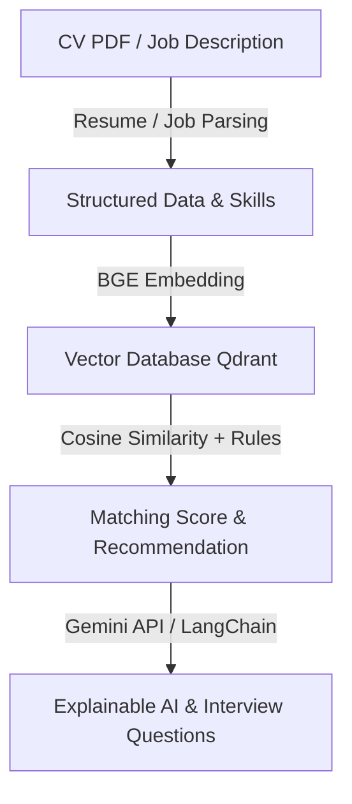

# 🚀 AI Recruitment Platform

Nền tảng tuyển dụng thông minh ứng dụng Trí tuệ Nhân tạo (AI) hỗ trợ kết nối ứng viên và nhà tuyển dụng thông qua NLP, Vector Embedding, Recommendation Engine và RAG Chatbot.

> **Đồ án:** Thực tập tốt nghiệp — Chuyên ngành **AI Engineer**

---

## 📌 Tổng Quan Dự Án (Project Overview)

**AI Recruitment Platform** là hệ thống tuyển dụng thế hệ mới. Khác với các trang tuyển dụng truyền thống chỉ tìm kiếm từ khóa tĩnh, hệ thống áp dụng các công nghệ AI hàng đầu để phân tích sâu nội dung **CV (Resume)** và **Job Description (JD)**, tính toán độ phù hợp (**Matching Score**), tự động gợi ý công việc/ứng viên và giải thích chi tiết lý do ghép nối (**Explainable AI**).

---

## 🎯 Mục Tiêu Dự Án (Project Goals)

- 👤 **Quản lý người dùng & Doanh nghiệp**: Phân quyền chi tiết cho Candidate, Recruiter, và Admin.
- 📄 **Phân tích hồ sơ (Resume & JD Parsing)**: Tự động trích xuất thông tin, kỹ năng, kinh nghiệm, bằng cấp bằng AI.
- 🎯 **Matching & Recommendation Engine**: Tính điểm phù hợp giữa CV & JD dựa trên Vector Embeddings & Cosine Similarity kết hợp Business Rules.
- 🔍 **Tìm kiếm ngữ nghĩa (Semantic Search)**: Tìm kiếm công việc/ứng viên theo ngữ cảnh thay vì từ khóa chính xác.
- 💡 **AI Giải thích (Explainable AI)**: Giải thích lý do phù hợp, chỉ ra kỹ năng còn thiếu và lộ trình cải thiện.
- 🤖 **AI Chatbot (RAG)**: Chatbot thông minh hỗ trợ hỏi đáp về JD, CV, quy trình tuyển dụng và chính sách công ty.

---

## 👥 Đối Tượng Sử Dụng (Target Users)

### 1. Candidate (Ứng viên)
- Đăng ký, đăng nhập và quản lý hồ sơ cá nhân.
- Tải lên CV (PDF) & tự động phân tích kỹ năng.
- Tìm kiếm việc làm với Semantic Search.
- Nhận đề xuất công việc phù hợp nhất từ AI.
- Theo dõi trạng thái ứng tuyển & Chat với AI Assistant.

### 2. Recruiter (Nhà tuyển dụng)
- Đăng ký doanh nghiệp, tạo & quản lý tin tuyển dụng (Job Postings).
- Xem danh sách ứng viên & AI Matching/Ranking tự động.
- Sinh câu hỏi phỏng vấn gợi ý bằng AI dựa trên hồ sơ ứng viên.
- Quản lý quy trình tuyển dụng và ứng tuyển.

### 3. Admin (Quản trị viên)
- Quản lý toàn bộ Người dùng, Doanh nghiệp, Tin tuyển dụng.
- Quản trị hệ thống & Dashboard thống kê.
- Theo dõi tần suất và chi phí sử dụng AI (AI Usage Monitoring).

---

## 🤖 Các Tính Năng AI Nổi Bật (AI Features)



1. **Resume & Job Parsing**: Trích xuất thông tin cá nhân, kỹ năng (Required/Preferred), học vấn, kinh nghiệm từ file PDF.
2. **Matching Engine**: Kết hợp BGE Embedding + Cosine Similarity + Business Rules để tính Matching Score.
3. **Recommendation Engine**: Đề xuất Top Jobs cho Ứng viên & Top Candidates cho Nhà tuyển dụng.
4. **Explainable AI**: Phân tích vì sao ứng viên phù hợp, chỉ ra điểm thiếu sót và khuyến nghị học tập.
5. **Semantic Search**: Tìm kiếm ngữ nghĩa thông qua Qdrant Vector Database.
6. **RAG Chatbot**: Chatbot hỏi đáp thông minh dựa trên dữ liệu JD & CV sử dụng LangChain.

---

## 💻 Công Nghệ Sử Dụng (Tech Stack)

| Thành phần | Công nghệ / Thư viện |
| :--- | :--- |
| **Frontend** | React, TypeScript, Vite, TailwindCSS, shadcn/ui |
| **Backend** | FastAPI, Python 3.12, SQLAlchemy, Alembic, Pydantic, JWT Auth |
| **Database** | Microsoft SQL Server |
| **Cache & Queue** | Redis |
| **Vector DB** | Qdrant |
| **AI / Machine Learning** | Sentence Transformers, BGE Embedding, Gemini API, LangChain |
| **DevOps & Infra** | Docker, Docker Compose, GitHub Actions |

---

## 📐 Kiến Trúc & Nguyên Tắc Phát Triển (Architecture & Principles)

- **Clean Architecture & SOLID**: Phân chia rõ ràng giữa Controller, Service Layer, Repository Pattern và Dependency Injection.
- **RESTful API Standard**: Thiết kế API chuẩn hóa, đầy đủ validation, logging và xử lý ngoại lệ.
- **Production-Ready Code**: Không viết code tạm, không hardcode dữ liệu, tối ưu khả năng mở rộng (Scalability).

---

## 📁 Cấu Trúc Thư Mục (Directory Structure)

```text
ai-recruitment-platform/
├── backend/          # FastAPI application (Clean Architecture)
├── frontend/         # React + Vite + TypeScript application
├── docs/             # Tài liệu thiết kế kiến trúc, API docs, báo cáo
├── docker/           # Dockerfiles & Nginx configurations
├── scripts/          # Database migrations, seeding & utility scripts
├── .github/          # GitHub Actions CI/CD workflows
├── task.txt          # File yêu cầu bài toán chi tiết
├── .env.example      # File cấu hình biến môi trường mẫu
├── .gitignore        # Các tệp/thư mục bỏ qua khi commit Git
├── docker-compose.yml# Docker Orchestration toàn bộ hệ thống
└── LICENSE           # MIT License
```

---

## 🚀 Hướng Dẫn Khởi Chạy (Quick Start)

### 1. Thiết lập biến môi trường
```bash
cp .env.example .env
```

### 2. Khởi chạy với Docker Compose
```bash
docker-compose up -d --build
```

---

## 📄 Giấy Phép (License)

Dự án được phát hành dưới giấy phép [MIT License](LICENSE).
