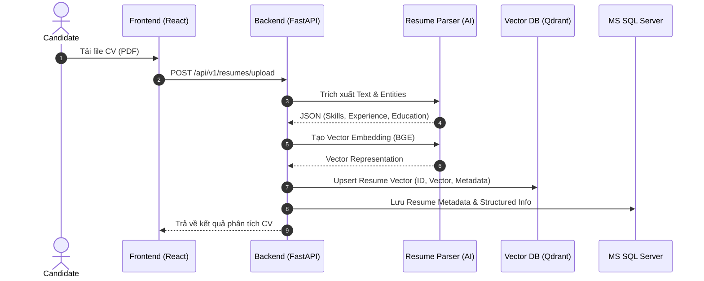
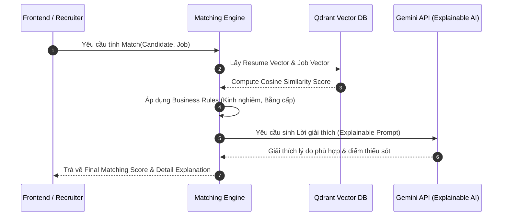

# 📐 System Architecture — AI Recruitment Platform

Tài liệu thiết kế kiến trúc chi tiết cho hệ thống **AI Recruitment Platform**.

---

## 🛠️ 1. Tổng Quan Kiến Trúc (Architecture Overview)

Hệ thống được thiết kế theo mô hình **Clean Architecture (Layered Architecture)** kết hợp với nguyên tắc **SOLID** nhằm đảm bảo tính linh hoạt, khả năng mở rộng (scalability) và dễ bảo trì.

```mermaid
graph TD
    User([User Client: React + Vite]) -->|HTTP REST API / WebSocket| Gateway[FastAPI API Gateway / Router]
    
    subgraph Backend Application (Clean Architecture)
        Gateway --> AuthMiddleware[JWT Auth & Middleware]
        AuthMiddleware --> Controllers[API Controllers / Routers]
        Controllers --> ServiceLayer[Service Layer - Business Logic]
        ServiceLayer --> RepositoryLayer[Repository Layer - Data Access]
        ServiceLayer --> AIEngine[AI Engine / Pipeline]
    end

    subgraph Data & Storage Layer
        RepositoryLayer --> SQLDB[(MS SQL Server)]
        ServiceLayer --> RedisCache[(Redis Cache / Queue)]
        AIEngine --> VectorDB[(Qdrant Vector DB)]
        AIEngine --> ExternalAI[Gemini API / LLMs]
    end
```

---

## 🏗️ 2. Các Tầng Trong Kiến Trúc (Architectural Layers)

### 2.1. Presentation Layer (Frontend)
- **Công nghệ**: React, TypeScript, Vite, TailwindCSS, shadcn/ui.
- **Vai trò**: Quản lý giao diện, trạng thái người dùng (State Management), gọi API qua Axios / React Query và render dữ liệu động.

### 2.2. API Layer (FastAPI Controllers)
- **Công nghệ**: FastAPI, Pydantic.
- **Vai trò**:
  - Đón nhận các HTTP Request, xác thực token (JWT).
  - Validation dữ liệu đầu vào thông qua Pydantic Schemas.
  - Chuyển tiếp yêu cầu xuống tầng **Service Layer** và trả về chuẩn JSON response.

### 2.3. Service Layer (Business Logic)
- **Vai trò**: 
  - Chứa toàn bộ nghiệp vụ chính của hệ thống (Xử lý ứng tuyển, Tạo tin tuyển dụng, Đề xuất công việc).
  - Điều phối làm việc giữa **Repository Layer** và **AI Engine Pipeline**.
  - Tuân thủ nguyên tắc Dependency Injection (DI).

### 2.4. AI Engine & Pipeline
- **Công nghệ**: Sentence Transformers, BGE Embedding, Qdrant Client, LangChain, Gemini API.
- **Vai trò**:
  - **Resume & JD Parsing**: Phân tích cú pháp và trích xuất thông tin cấu trúc từ PDF/Văn bản.
  - **Embedding & Vector Store**: Chuyển đổi văn bản thành Vector 1024-dim và lưu trữ tại Qdrant.
  - **Matching Engine**: Tính toán Cosine Similarity + Business Rules.
  - **Explainable AI & RAG**: Tạo lời giải thích ghép nối và vận hành Chatbot tư vấn.

### 2.5. Repository Layer & Data Access
- **Công nghệ**: SQLAlchemy (Async), Alembic, PyODBC.
- **Vai trò**: 
  - Trừu tượng hóa các truy vấn CSDL MS SQL Server thông qua Repository Pattern.
  - Tách biệt logic truy xuất dữ liệu ra khỏi logic nghiệp vụ.

---

## 🔄 3. Luồng Xử Lý AI (AI Data Pipelines)

### 3.1. Luồng Upload & Phân Tích CV (Resume Parsing Pipeline)


### 3.2. Luồng Phân Tích Khớp Nối (Matching Engine Pipeline)


---

## 🗄️ 4. Mô Hình Dữ Liệu Thực Thể (Entity Relationship Overview)

Các bảng chính trong CSDL Microsoft SQL Server:
- `Users`: Quản lý tài khoản, vai trò (Candidate, Recruiter, Admin), thông tin đăng nhập.
- `Companies`: Thông tin doanh nghiệp, địa chỉ, website, quy mô.
- `Candidates`: Thông tin chi tiết ứng viên, tiêu đề nghề nghiệp, mức lương mong muốn.
- `Resumes`: Lưu vết file CV PDF, kết quả trích xuất dạng JSON, link lưu trữ.
- `Jobs`: Thông tin công việc, yêu cầu kỹ năng, khoảng lương, trạng thái tuyển dụng.
- `Applications`: Quản lý lượt ứng tuyển, trạng thái ứng tuyển (Pending, Shortlisted, Interviewed, Rejected).
- `Matches`: Lưu trữ điểm Matching Score, chi tiết điểm kỹ năng, điểm kinh nghiệm và nội dung giải thích từ AI.
- `AI_Audit_Logs`: Theo dõi lượt gọi AI APIs, thời gian phản hồi và số lượng Tokens tiêu thụ.

---

## 🛡️ 5. Nguyên Tắc Thiết Kế (Design Principles)

1. **SOLID Principles**:
   - **Single Responsibility**: Mỗi class/module chỉ chịu một trách nhiệm duy nhất.
   - **Open/Closed**: Dễ dàng mở rộng thêm các AI Model mới mà không sửa đổi code cũ.
   - **Dependency Inversion**: Các module cấp cao không phụ thuộc trực tiếp module cấp thấp mà phụ thuộc vào Abstraction/Interface.
2. **Security**:
   - Xác thực JWT Token với thời hạn Access/Refresh Token.
   - Mã hóa mật khẩu với Bcrypt / Argon2.
   - Sanitize dữ liệu đầu vào chống SQL Injection và XSS attack.
