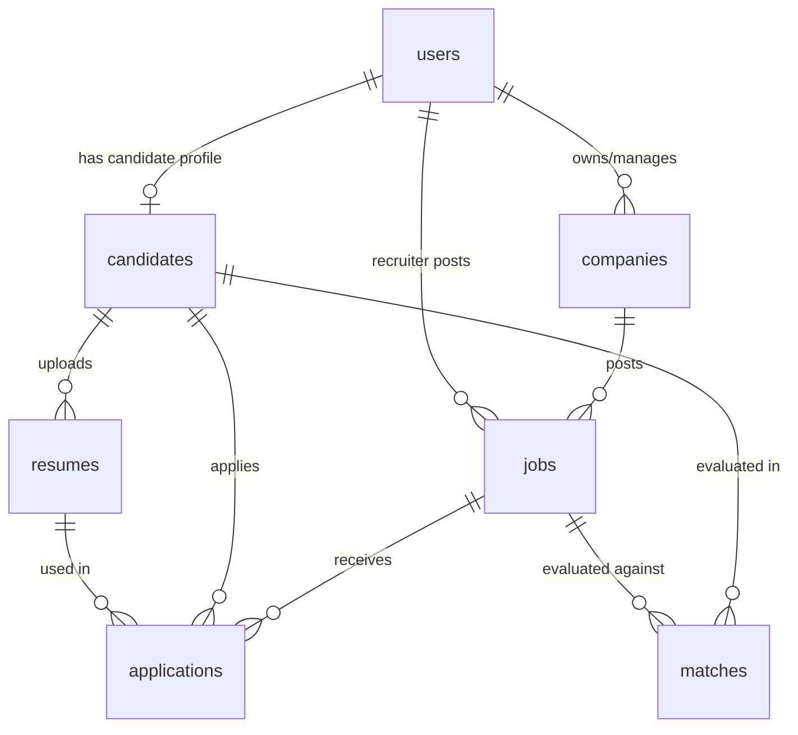

# 🗄️ Database Design — AI Recruitment Platform

Tài liệu thiết kế Cơ sở Dữ liệu quan hệ (Microsoft SQL Server) cho hệ thống **AI Recruitment Platform**.

---

## 📌 1. Bảng Dữ Liệu (Database Tables)

Tuân thủ quy tắc đặt tên [PROJECT_RULES.md](file:///D:/learn/Ai-Engineer-Lab/ai-recruitment-platform/docs/ai-agents/PROJECT_RULES.md): Tên bảng dạng số nhiều (`plural nouns`), snake_case.

### 1.1. Bảng `users`
Lưu trữ thông tin người dùng và phân quyền hệ thống.

| Tên Cột | Kiểu Dữ Liệu | Khóa | Ràng Buộc | Mô Tả |
| :--- | :--- | :--- | :--- | :--- |
| `id` | UNIQUEIDENTIFIER | PK | DEFAULT NEWID() | Định danh người dùng (UUID) |
| `email` | NVARCHAR(255) | Unique | NOT NULL | Email đăng nhập |
| `hashed_password` | NVARCHAR(255) | | NOT NULL | Mật khẩu đã hash (Bcrypt/Argon2) |
| `full_name` | NVARCHAR(255) | | NOT NULL | Họ và tên |
| `phone_number` | VARCHAR(20) | | NULL | Số điện thoại |
| `role` | VARCHAR(20) | | NOT NULL | Vai trò: `candidate`, `recruiter`, `admin` |
| `is_active` | BIT | | DEFAULT 1 | Trạng thái tài khoản |
| `created_at` | DATETIME2 | | DEFAULT SYSDATETIME() | Ngày tạo |
| `updated_at` | DATETIME2 | | DEFAULT SYSDATETIME() | Ngày cập nhật |

---

### 1.2. Bảng `companies`
Thông tin doanh nghiệp tuyển dụng.

| Tên Cột | Kiểu Dữ Liệu | Khóa | Ràng Buộc | Mô Tả |
| :--- | :--- | :--- | :--- | :--- |
| `id` | UNIQUEIDENTIFIER | PK | DEFAULT NEWID() | ID doanh nghiệp |
| `user_id` | UNIQUEIDENTIFIER | FK | NULL -> users(id) | Nhà tuyển dụng quản lý công ty này |
| `name` | NVARCHAR(255) | | NOT NULL | Tên công ty |
| `website` | VARCHAR(255) | | NULL | Website chính thức |
| `location` | NVARCHAR(255) | | NULL | Địa chỉ trụ sở |
| `company_size` | VARCHAR(50) | | NULL | Quy mô (VD: 10-50, 100-500) |
| `description` | NVARCHAR(MAX) | | NULL | Mô tả công ty |
| `logo_url` | VARCHAR(500) | | NULL | Link ảnh logo |
| `created_at` | DATETIME2 | | DEFAULT SYSDATETIME() | Ngày tạo |
| `updated_at` | DATETIME2 | | DEFAULT SYSDATETIME() | Ngày cập nhật |

---

### 1.3. Bảng `candidates`
Thông tin chi tiết hồ sơ ứng viên.

| Tên Cột | Kiểu Dữ Liệu | Khóa | Ràng Buộc | Mô Tả |
| :--- | :--- | :--- | :--- | :--- |
| `id` | UNIQUEIDENTIFIER | PK | DEFAULT NEWID() | ID ứng viên |
| `user_id` | UNIQUEIDENTIFIER | FK | NOT NULL -> users(id) | Liên kết tài khoản User |
| `title` | NVARCHAR(255) | | NULL | Tiêu đề nghề nghiệp (VD: Senior Python Dev) |
| `bio` | NVARCHAR(MAX) | | NULL | Giới thiệu bản thân |
| `experience_years` | FLOAT | | DEFAULT 0 | Số năm kinh nghiệm tổng cộng |
| `expected_salary` | DECIMAL(18,2) | | NULL | Mức lương mong muốn |
| `location` | NVARCHAR(255) | | NULL | Địa điểm làm việc mong muốn |
| `created_at` | DATETIME2 | | DEFAULT SYSDATETIME() | Ngày tạo |
| `updated_at` | DATETIME2 | | DEFAULT SYSDATETIME() | Ngày cập nhật |

---

### 1.4. Bảng `resumes`
Lưu trữ thông tin CV đã tải lên và dữ liệu AI trích xuất.

| Tên Cột | Kiểu Dữ Liệu | Khóa | Ràng Buộc | Mô Tả |
| :--- | :--- | :--- | :--- | :--- |
| `id` | UNIQUEIDENTIFIER | PK | DEFAULT NEWID() | ID Resume |
| `candidate_id` | UNIQUEIDENTIFIER | FK | NOT NULL -> candidates(id) | Liên kết Ứng viên |
| `file_name` | NVARCHAR(255) | | NOT NULL | Tên file PDF gốc |
| `file_url` | VARCHAR(500) | | NOT NULL | Đường dẫn file lưu trữ |
| `parsed_json` | NVARCHAR(MAX) | | NULL | Dữ liệu cấu trúc AI trích xuất (JSON) |
| `qdrant_vector_id` | VARCHAR(100) | | NULL | ID Vector tương ứng lưu tại Qdrant |
| `is_primary` | BIT | | DEFAULT 0 | Đánh dấu CV chính |
| `created_at` | DATETIME2 | | DEFAULT SYSDATETIME() | Ngày upload |

---

### 1.5. Bảng `jobs`
Danh sách tin tuyển dụng.

| Tên Cột | Kiểu Dữ Liệu | Khóa | Ràng Buộc | Mô Tả |
| :--- | :--- | :--- | :--- | :--- |
| `id` | UNIQUEIDENTIFIER | PK | DEFAULT NEWID() | ID tin tuyển dụng |
| `company_id` | UNIQUEIDENTIFIER | FK | NOT NULL -> companies(id) | Thuộc công ty |
| `recruiter_id` | UNIQUEIDENTIFIER | FK | NOT NULL -> users(id) | Nhà tuyển dụng đăng tin |
| `title` | NVARCHAR(255) | | NOT NULL | Tiêu đề công việc |
| `description` | NVARCHAR(MAX) | | NOT NULL | Mô tả chi tiết JD |
| `requirements` | NVARCHAR(MAX) | | NULL | Yêu cầu ứng viên |
| `parsed_json` | NVARCHAR(MAX) | | NULL | Kỹ năng AI trích xuất từ JD (JSON) |
| `qdrant_vector_id` | VARCHAR(100) | | NULL | ID Vector tương ứng tại Qdrant |
| `location` | NVARCHAR(255) | | NULL | Địa điểm làm việc |
| `salary_min` | DECIMAL(18,2) | | NULL | Lương tối thiểu |
| `salary_max` | DECIMAL(18,2) | | NULL | Lương tối đa |
| `status` | VARCHAR(20) | | DEFAULT 'active' | Status: `draft`, `active`, `closed` |
| `created_at` | DATETIME2 | | DEFAULT SYSDATETIME() | Ngày tạo |
| `updated_at` | DATETIME2 | | DEFAULT SYSDATETIME() | Ngày cập nhật |

---

### 1.6. Bảng `applications`
Quản lý lượt nộp hồ sơ của ứng viên.

| Tên Cột | Kiểu Dữ Liệu | Khóa | Ràng Buộc | Mô Tả |
| :--- | :--- | :--- | :--- | :--- |
| `id` | UNIQUEIDENTIFIER | PK | DEFAULT NEWID() | ID lượt ứng tuyển |
| `job_id` | UNIQUEIDENTIFIER | FK | NOT NULL -> jobs(id) | Công việc ứng tuyển |
| `candidate_id` | UNIQUEIDENTIFIER | FK | NOT NULL -> candidates(id) | Ứng viên nộp |
| `resume_id` | UNIQUEIDENTIFIER | FK | NOT NULL -> resumes(id) | CV được sử dụng |
| `status` | VARCHAR(30) | | DEFAULT 'pending' | `pending`, `reviewed`, `interviewed`, `accepted`, `rejected` |
| `cover_letter` | NVARCHAR(MAX) | | NULL | Thư giới thiệu |
| `created_at` | DATETIME2 | | DEFAULT SYSDATETIME() | Ngày nộp đơn |

---

### 1.7. Bảng `matches`
Lưu trữ điểm số Matching Engine & Explainable AI.

| Tên Cột | Kiểu Dữ Liệu | Khóa | Ràng Buộc | Mô Tả |
| :--- | :--- | :--- | :--- | :--- |
| `id` | UNIQUEIDENTIFIER | PK | DEFAULT NEWID() | ID kết quả Match |
| `candidate_id` | UNIQUEIDENTIFIER | FK | NOT NULL -> candidates(id) | ID Ứng viên |
| `job_id` | UNIQUEIDENTIFIER | FK | NOT NULL -> jobs(id) | ID Công việc |
| `matching_score` | FLOAT | | NOT NULL | Điểm tổng hợp (0 - 100%) |
| `semantic_score` | FLOAT | | NOT NULL | Điểm tương đồng Vector Cosine |
| `skill_score` | FLOAT | | NOT NULL | Điểm khớp kỹ năng |
| `experience_score` | FLOAT | | NOT NULL | Điểm khớp số năm kinh nghiệm |
| `explanation_text` | NVARCHAR(MAX) | | NULL | Nội dung AI giải thích chi tiết |
| `missing_skills` | NVARCHAR(MAX) | | NULL | Danh sách kỹ năng còn thiếu (JSON) |
| `created_at` | DATETIME2 | | DEFAULT SYSDATETIME() | Thời điểm tính toán |

---

## 🔗 2. Relationship Diagram

